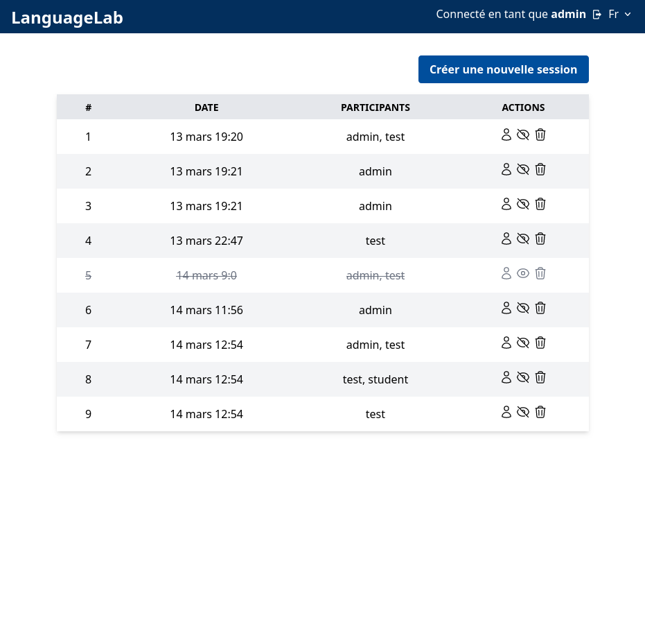

# LanguageLab

LanguageLab is a set of web apps for practicing foreign languages and measuring their development. It is still in development.

## Getting started

The project is divided into a backend API, written in Python using FastAPI, and a frontend, written in Svelte. Both are technically independent.

### Backend

```sh
cd backend/app
pip install -r ../requirements.txt
uvicorn main:app # add --reload for development
```

### Frontend

```sh
cd frontend
npm install
npm run dev # for development
npm run build # for production
```

### Screenshots

|          Home page          |       Session/Chat page        |
| :-------------------------: | :----------------------------: |
|  |  |
