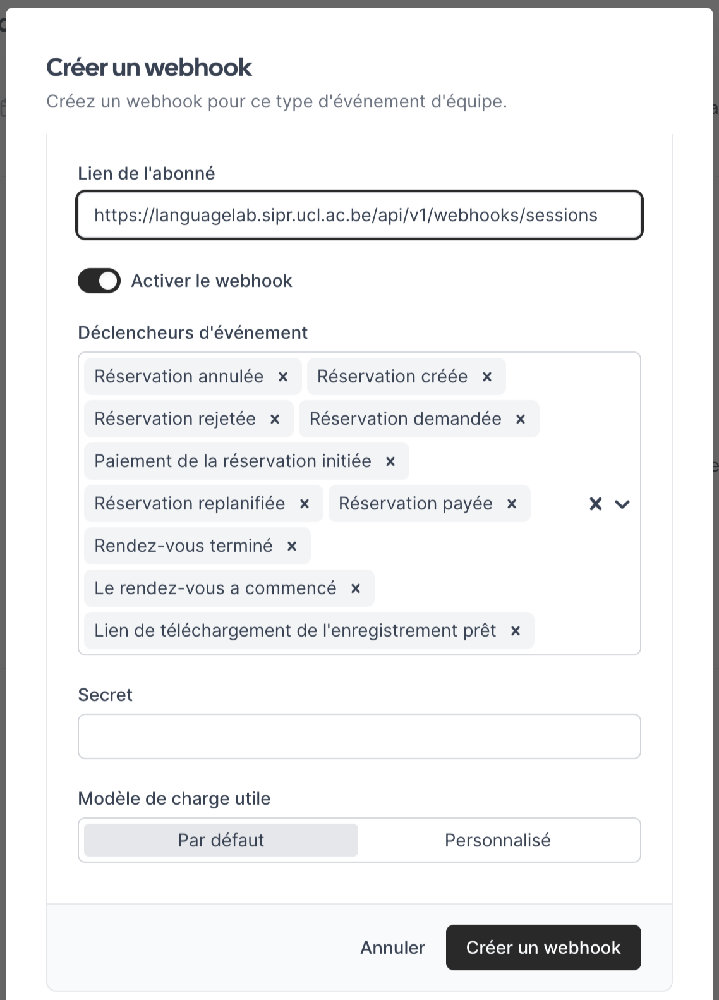

LanguageLab utilise le site https://cal.com pour programmer les séances entre les tuteurs et les étudiants.

Afin que l'intégration soit réussie, il est nécessaire de suivre les étapes suivantes:
 - Créer un compte sur https://cal.com.
 - Créer un nouveau type d'événement de 60 mins (https://app.cal.com/event-types -> [+ Nouveau]).
 - Créer un webhook (onglet "Webhooks") avec l'URL https://languagelab.sipr.ucl.ac.be/api/v1/webhooks/sessions comme Lien de l'abonné. Tous les "Déclencheurs d'évènement" (triggers) peuvent être laissés tels quel. "Secret" peut être laissé vide. [Créer un webhook]
   
 - Copier le lien vers l'évènement [🔗], p.ex. https://cal.com/username/eventtype
 - Coller le lien dans https://languagelab.sipr.ucl.ac.be/tutor/timeslots.
